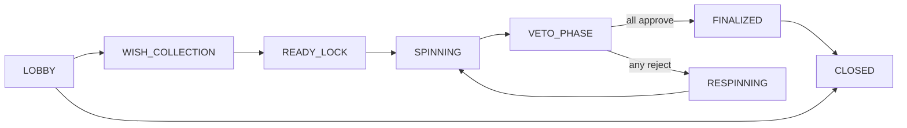

# Glitchub

Multiplayer game-night coordination platform: book sessions, join instant rooms, build a shared wish pool, spin for a game, and vote to finalize — with Clerk Organizations, a deterministic room FSM, and Neon PostgreSQL.

---

## Tech stack

| Layer | Stack |
|--------|--------|
| Frontend | React 19, TypeScript, Vite, React Router |
| Backend | Node.js, Express 5 |
| Database | Neon PostgreSQL (`pg`) |
| Auth | Clerk (users + Organizations) |
| Email | Resend (invites, proposal notifications) |
| Realtime | WebSocket (spin animation) + HTTP polling (`/live`) |

---

## Features

### Hosts & rooms

- **Scheduled bookings** — host invitations, email RSVP, `scheduled_at` gate for game start
- **Instant rooms** — 4–6 digit join code, face-to-face join
- **Room FSM** — `LOBBY → WISH_COLLECTION → READY_LOCK → SPINNING → VETO_PHASE → FINALIZED → CLOSED`
- **Readiness gate** — host can start only when all **online** members are ready; offline members do not block
- **Wish pool** — each player picks 3 games (or empty slots); host can force advance to ready lock
- **Spin & veto** — authoritative server spin, unanimous approve to finalize, reject triggers respin (veto limit per user)
- **Presence** — heartbeat TTL (45s); `DELETE /presence` on leave clears online + ready state
- **Live snapshot** — `GET /api/rooms/:id/live` aggregates session, members, votes, wish pool, readiness, progress
- **Lightweight reputation** — attendance / no-show / completion rates; badge on member cards (display only)

### Organization

- **Game library** — org-scoped catalog seeded from reference games
- **Game proposals** — blind vote to add/remove games; 24h window; resolver cron + lazy resolve on read
- **Clerk org RBAC** — org membership drives library and proposal access

### Reliability & consistency

- **FSM event processor** — single entry `processRoomEvent`; `eventId` idempotency at boundary
- **Concurrency** — `FOR UPDATE` on spin / veto / finalize; veto uniqueness per user per room
- **Rate limiting** — in-memory per `roomId + userId + action` (disabled in chaos tests via env)

---

## Quick start

### 1. Install

```bash
npm install
cp .env.example .env
# Fill DATABASE_URL, Clerk keys, Resend (optional for email tests)
```

### 2. Database

Use a **Neon pooled** connection string in `DATABASE_URL`. On first `server:dev` boot, core tables are auto-created. For legacy deployments, run migrations as needed:

```bash
npm run db:migrate:host-invitations
npm run db:migrate:appointments
npm run db:migrate:room-presence
npm run db:seed:reference-catalog
```

### 3. Development

```bash
# Terminal 1 — API (default :8787)
npm run server:dev

# Terminal 2 — Vite (default :5173)
npm run dev
```

Open [http://localhost:5173](http://localhost:5173). Health check: `GET http://localhost:8787/api/health`.

### 4. Production build

```bash
npm run build
npm run start
```

`start` serves the Vite `dist/` build and the Express API from one process (see `scripts/start-production.mjs`).

---

## Environment variables

See [`.env.example`](.env.example). Minimum for local dev:

| Variable | Purpose |
|----------|---------|
| `DATABASE_URL` | Neon PostgreSQL (pooled recommended) |
| `VITE_CLERK_PUBLISHABLE_KEY` | Clerk frontend |
| `CLERK_SECRET_KEY` | Clerk backend JWT verify |
| `PORT` | API port (default `8787`) |
| `APP_PUBLIC_ORIGIN` | Links in emails (default `http://localhost:5173`) |

Optional: `RESEND_*` (email), `CLERK_WEBHOOK_SIGNING_SECRET` (user sync), `ROOM_SPIN_DURATION_MS`, `ORG_PROPOSAL_*`, `CHAOS_*` (tests only).

---

## npm scripts

### Development

| Script | Description |
|--------|-------------|
| `npm run dev` | Vite frontend |
| `npm run server:dev` | Express API with `--watch` |
| `npm run build` | `tsc` + Vite production bundle |
| `npm run start` | Production server |
| `npm run lint` | ESLint |
| `npm run assets:logo` | Regenerate logo/favicon from `assets/logo-source.png` |

### Integration tests (`scripts/tests/`)

| Script | Description |
|--------|-------------|
| `npm run test:integration` | Room coordination + org proposals (~30s) |
| `npm run test:room-coordination` | Readiness gate, reputation, UX mapping |
| `npm run test:room-fsm-flow` | Full 5-player FSM happy path |
| `npm run test:room-fsm-chaos` | Concurrency, idempotency, replay |
| `npm run test:org-game-proposals` | Blind vote proposal workflow |
| `npm run test:db` | DB connectivity smoke |
| `npm run test:appointment-invite` | Invite respond API |
| `npm run test:clerk-webhook` | Webhook signature verify |
| `npm run test:clerk-user-sync` | Clerk → Neon + Resend sync |
| `npm run test:resend` | Resend API key check |

Chaos suite env: `CHAOS_FAST=1`, `CHAOS_SKIP_STRESS=1` (see [`scripts/tests/README.md`](scripts/tests/README.md)).

### Database & ops

| Script | Description |
|--------|-------------|
| `npm run db:seed:reference-catalog` | Seed global reference game catalog |
| `npm run db:seed:org-games-from-reference` | Copy reference games into an org library |
| `npm run db:verify:reference-catalog` | Verify catalog integrity |
| `npm run db:purge:stale-rooms` | Purge expired / stale room rows |

---

## Project layout

```
glitchub/
├── src/                    # React app
│   ├── pages/
│   │   ├── dashboard/      # Home, org, games, hosts (book/join/room)
│   │   └── AuthShell.tsx   # Sign-in / sign-up shell
│   └── components/         # GlitchubLogo, etc.
├── server/                 # Express API
│   ├── roomFsm/            # FSM, eventProcessor, spin engine, rate limit
│   ├── orgGames/           # Proposals, resolver, org library routes
│   ├── reputation/         # Lightweight user reliability stats
│   ├── roomLive.js         # GET /live aggregate read model
│   └── index.js            # App bootstrap, route registration
├── scripts/
│   ├── tests/              # Integration & chaos tests (isolated)
│   └── *.mjs               # Migrations, seeds, purge, logo gen
├── public/                   # favicon, logo assets
└── assets/                   # logo-source.png for assets:logo
```

---

## Room API (summary)

**Read (prefer one poll):**

- `GET /api/rooms/:roomId/live` — session, members, votes, wish pool, readiness, progress

**Mutations:**

- `POST /api/rooms/:roomId/presence` · `DELETE .../presence`
- `POST /api/rooms/:roomId/game-session/start|ready|force-lock`
- `PUT /api/rooms/:roomId/wish-pool`
- `POST /api/rooms/:roomId/spin` · `GET .../spin/latest`
- `POST /api/rooms/:roomId/votes`
- `POST /api/rooms/:roomId/events` — generic FSM events
- `POST /api/rooms/:roomId/end` — host close room

Instant join: `POST /api/rooms/instant` + join code flow under `/api/rooms/join`.

---

## Room phase flow



**LOBBY start rule:** all members with a fresh presence heartbeat must have toggled Ready before the host can start.

---

## Clerk webhook (optional)

1. Expose `https://<tunnel>/api/webhooks/clerk` to local `:8787`
2. Subscribe to `user.created` / `user.updated`
3. Set `CLERK_WEBHOOK_SIGNING_SECRET` in `.env`

Syncs users to Neon (`clerk_synced_users`) and optionally Resend Audiences.

---

## License

Private — ITTC / Glitchub internal use unless otherwise noted.
