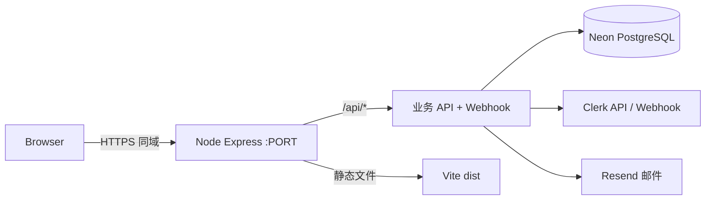

# Glitchub 前后端部署

生产环境推荐 **单进程同域部署**：Express 同时提供 `/api/*` 与 Vite 构建产物（`dist/`）。前端所有请求使用相对路径 `/api/...`，无需再配 CORS 或 `VITE_API_URL`。

开发时仍为两个进程：`npm run dev`（5173）+ `npm run server:dev`（8787），由 Vite 代理 `/api`。

## 架构一览



## 1. 环境变量

复制 `.env.example` 为 `.env`（本地）或在托管平台配置 **运行时** 变量：

| 变量 | 构建时 / 运行时 | 说明 |
|------|-----------------|------|
| `VITE_CLERK_PUBLISHABLE_KEY` | **构建时**（`npm run build`） | 打进前端 bundle |
| `DATABASE_URL` | 运行时 | Neon 连接串 |
| `CLERK_SECRET_KEY` | 运行时 | 仅后端 |
| `CLERK_WEBHOOK_SIGNING_SECRET` | 运行时 | Clerk Webhook 验签 |
| `RESEND_*`、`APP_PUBLIC_ORIGIN` | 运行时 | 邮件与站内链接根 URL |
| `PORT` | 运行时 | 默认 `8787` |
| `HOST` | 运行时 | 默认生产 `0.0.0.0` |

生产务必设置：

```env
APP_PUBLIC_ORIGIN=https://你的域名
NODE_ENV=production
```

`APP_PUBLIC_ORIGIN` 用于预约邀请等邮件里的链接，需与对外访问域名一致。

## 2. 数据库迁移（首次 /  schema 变更）

在能访问 `DATABASE_URL` 的环境执行（本地或 CI 一次性任务）：

```bash
npm run db:migrate:host-invitations
npm run db:migrate:appointments
npm run db:migrate:room-presence
npm run db:seed:reference-catalog   # 可选：游戏库种子
```

## 3. 本地验证生产构建

```bash
# 确保 .env 含 VITE_CLERK_PUBLISHABLE_KEY 与 DATABASE_URL
npm run build
npm start
```

浏览器打开 `http://127.0.0.1:8787`，检查登录与 `/api/health`。

## 4. Docker 部署

```bash
docker build \
  --build-arg VITE_CLERK_PUBLISHABLE_KEY=pk_live_xxx \
  -t glitchub .

docker run --rm -p 8787:8787 --env-file .env glitchub
```

平台（Railway / Render / Fly.io 等）通常：连接 Git 仓库 → 使用根目录 `Dockerfile` → 在面板配置环境变量 → 将 `PORT` 映射为平台注入的端口（多数平台会设置 `PORT`，无需改代码）。

## 5. 裸机 / VPS（无 Docker）

```bash
git pull
npm ci
export VITE_CLERK_PUBLISHABLE_KEY=pk_live_xxx   # 构建前
npm run build
# 用 systemd / pm2 等守护：
npm start
```

前置 **反向代理**（Nginx / Caddy）将 `https://域名` 转到 `127.0.0.1:8787`，并配置 TLS。

## 6. Clerk 与 Webhook

1. Clerk Dashboard → **Domains**：加入生产域名。
2. **Webhooks** → Endpoint：`https://你的域名/api/webhooks/clerk`
3. 订阅 `user.created`、`user.updated`（与当前后端一致）。
4. 将 Signing Secret 写入 `CLERK_WEBHOOK_SIGNING_SECRET`。

## 7. 前后端分离部署（可选，需改代码）

当前前端写死 `fetch('/api/...')`，分离部署需其一：

- 在 CDN / 静态托管上把 `/api` **反代**到后端；或
- 增加 `VITE_API_BASE_URL` 并改所有 API 调用（仓库尚未实现）。

因此默认方案为 **同域单服务**，最简单且与现有代码一致。

## 8. 部署后自检

| 检查项 | 命令 / 操作 |
|--------|-------------|
| 进程与端口 | 平台健康检查或 `curl -s https://域名/api/health` |
| 数据库 | 响应 `{"ok":true,"db":...}` |
| 静态页 | 打开 `/`、`/sign-up`，刷新子路由无 404 |
| Clerk 登录 | 生产 Publishable Key 与域名白名单 |
| 邮件链接 | 发测试邀请，确认链接 host 为 `APP_PUBLIC_ORIGIN` |

## 9. 常见问题

- **构建后 Clerk 报错**：构建阶段未传入 `VITE_CLERK_PUBLISHABLE_KEY`，需重新 `npm run build`。
- **API 503 DATABASE_URL**：运行时未配置或 Neon IP 限制。
- **Webhook 验签失败**：URL 必须是公网 HTTPS，Secret 与 Dashboard 一致。
- **刷新子路由 404**：未走 Node 托管（例如只上传了 `dist` 到纯静态站）；应使用 `npm start` 或 Docker 镜像。
