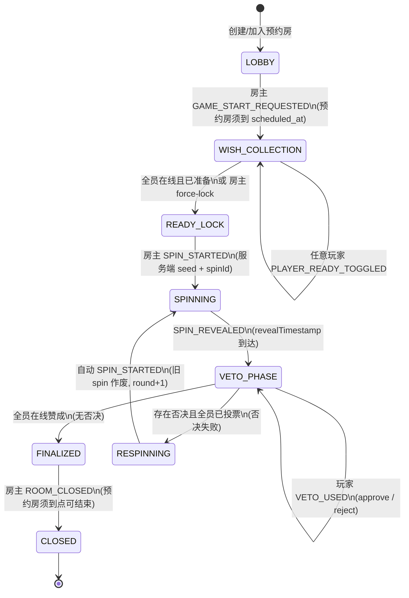
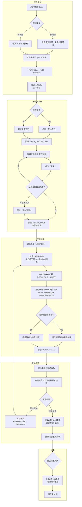
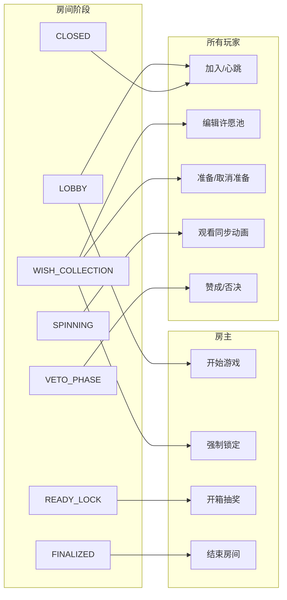
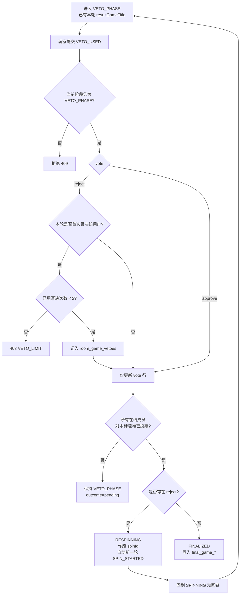
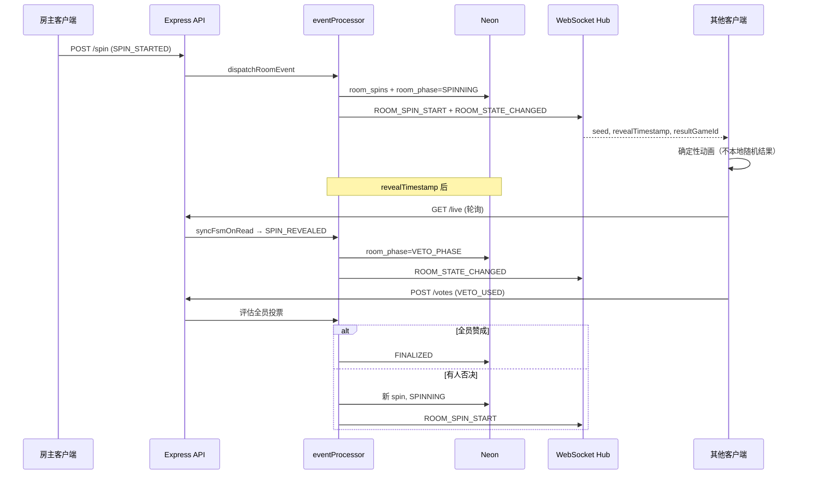

# Glitchub 房间用户流程图

本文描述从进入房间到结束的**完整用户旅程**与**服务端 FSM 状态**对应关系。权威状态以 `appointments.room_phase` 为准。

---

## 1. 房间状态机（FSM）

---

## 2. 端到端用户流程（主流程）

---

## 3. 角色与可操作项（按阶段）

| 阶段 | 房主 | 全体玩家 | 前端 UI 锁定 |
|------|------|----------|----------------|
| LOBBY | 开始游戏 | 加入、在线展示 | 许愿池/抽奖/投票不可用 |
| WISH_COLLECTION | 强制锁定 | 许愿池、准备 | 可编辑许愿；不可抽奖 |
| READY_LOCK | 开箱 | 等待 | 许愿池只读 |
| SPINNING | — | 只看动画 | 不可投票 |
| VETO_PHASE | 同玩家 | 赞成/否决（限 2 次否决权） | 不可改许愿 |
| FINALIZED | 结束房间 | 查看最终游戏 | 揭晓层 |
| CLOSED | — | 被踢回大厅/加入页 | — |

---

## 4. 否决与重抽决策

---

## 5. 同步与数据来源

---

## 6. 与测试脚本对应关系

`npm run test:room-fsm-flow` 覆盖的路径：

1. LOBBY → 创建 5 虚拟用户  
2. GAME_START_REQUESTED → WISH_COLLECTION  
3. WISHLIST_UPDATED ×5  
4. PLAYER_READY_TOGGLED ×5 → READY_LOCK  
5. SPIN_STARTED → SPINNING →（快进时间）→ VETO_PHASE  
6. 1× reject + 4× approve → 自动重抽  
7. 5× approve → FINALIZED  
8. ROOM_CLOSED → 清理数据  

详见 [scripts/test-room-fsm-flow.mjs](../scripts/test-room-fsm-flow.mjs)。
